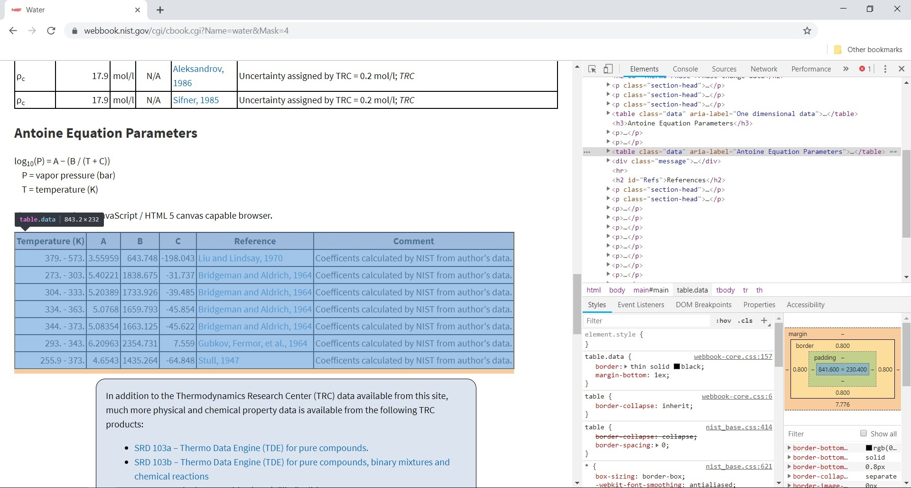

# Scraping the NIST WebBook with Python to extract Antoine Equation Parameters

As Chemical Engineers know, performing chemical processes often needs them to use tabulated data on websites coded before API's time so there is no other way to get the information that manually copy and paste it into their owns (probably MS Excel) Data Bases and then import it into workflow for such calculating purpose. 

With that idea on mind it was built a small script for extracting the *Antoine Equation Parameters* from the **National Institute of Standards and Technology** of  the U.S. Department of Commerce [online Chemistry WebBook](https://webbook.nist.gov/chemistry/). However, if any of the readers want to get another data from the same or different source, I hope the explanation showed below will be good enough for them to reach it.

<span class="message note">Note: Reference to better articles and explanations are listed at the bottom</span>

## What is Web Scraping

The web scraping process is nothing else that the classic copy and paste you maybe used in school for doing homework,  but take it to next level using algorithms that understand website structure and are capable to filter and storage it into variables. Whether you understand or not the language Internet is coding with, there are libraries and modules written for all the popular programming languages simplifying the process to a few lines of code, even so I feel understand basic HTML and CSS selectors is key in nowadays world.

## Hands On

The task you need to do previously is checking if you have the next two packages and download them if not.

* [request](http://docs.python-requests.org/en/master/) for performing the HTTP requests
* [BeautifulSoup](https://www.crummy.com/software/BeautifulSoup/bs4/doc/) for handling the HTML filtering

Now you are ready for opening up your code editor and follow the explanation. The fist step is  to import.

```python
from request import get
from bs4 import BeautifulSoup
```

We just import the `get()` function from `request`, and like its name says, it allows us to make GET requests as if it were a web browser, without getting our hands dirt.

## Make the GET request

The GET request returns the server response –aka website– to our workflow although we must provide a `url` or web address to the function. But, what `url` could we pass? Well, this is not a master in HTTP requests or anything like that so if you are not familiarized with it, let me sum it up for you.

It happens that you as a web client can send public `variables` and their values to the server through the web address just like this:

```
https://www.example.com/page?var1=value1&var2=value2
```

Where `var1` and `var2` are the variables passed with their respective values after que equal sign, and the ampersand (&) works as a separator for concatenating multiple variables. So, having it in mind, just give a look to these NIST WebBook links.

```
https://webbook.nist.gov/cgi/cbook.cgi?Name=water&Mask=4
https://webbook.nist.gov/cgi/cbook.cgi?Name=methane&Mask=4
```

Both have the `Name` variable and the `Mask` variable. Which the first one ask for what substance you are looking and the second is used to show or hide content into the view.

Finally, we have:

```python
def get_response(url):
    return raw_html = get(url).content
```

We are treating the `url` value in a while, for now you must understand that I put the `get()` function in the `get_response()` function because I'll add Exceptions Handle then and separate the process of getting the `.content` from the process of analyze it. For now, we are assuming all the requests are positive.

## Take all the unnecessary off

This is the table I want to "copy and paste" to my algorithm and more exactly, the first to fourth columns:




**How can we do that?** This way: 

Find some CSS selector or attribute only this table has using the DOM inspector in your web browser. For Chrome/Chromium make second click over the table and select `Inspect` on the pop up. In this case, the attribute `aria-label` label is unique and its value **_"Antoine Equation Parameters"_** 

```python
def get_html_table(Name):
    
    # We treat the url attaching the Name variable to it.
    url = str.format('https://webbook.nist.gov/cgi/cbook.cgi?Name={0}&Mask=4', Name.lower())

    # Function to get the request made, see above.
    raw_html = get_response(url)

    # Parse the html using BeautifulSoup.
    html = BeautifulSoup(raw_html, 'html.parser')

    # Extract the table that contains the data, the table has a specific
    # attributes 'aria-label' as 'Antoine Equation Parameters'.
    table = html.find('table', attrs={'aria-label': 'Antoine Equation Parameters'})
    
    return table
```

We define the `get_html_table` function, work on the `url` and make the request to get the `respond.content` within the top *7 lines*. While *line 10* parse the `raw_html` variable and create an instance of  a BeautifulSoup object (see documentation for more information) and storage it into `html`, *line 14* using   the `find()` function from the BeautifulSoup  library, extracting the only one table which `aria-label`  attribute is exactly `'Anotine Equation Parameters'` value.

