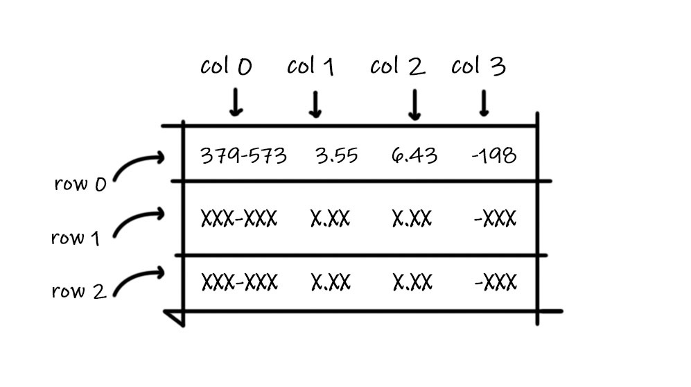

# Scraping the NIST Webbook with Python to extract Antoine Equation Parameters

As Chemical Engineers can know, performing chemical processes often needs them to use tabulated data on websites coded before API's time so there is no other way to get the information that manually copy and paste it into their owns (probably MS Excel) Databases and then import it into workflow for such calculating purpose. 


With this idea on mind it was built a small script for extracting the *Antoine Equation Parameters* from the **National Institute of Standards and Technology** of  the U.S. Department of Commerce [Online Chemistry Webbook](https://webbook.nist.gov/chemistry/). However, if any of the readers want to get another data from the same or different source, I hope the explanation showed below will be good enough for them to achieve it.

**Note: References to better articles and explanations are listed at the bottom**

## What is Web Scraping

The web scraping process is nothing else that the classic copy and paste you maybe used in school for doing homework,  but take it to the next level using algorithms that understand website structure and are capable to filter and storage it into variables. Whether you understand or not the language Internet is coding with, there are libraries and modules written for all the popular programming languages simplifying the process to a few lines of code. Even so, I feel understand basic HTML and CSS selectors is key in nowadays world.

## Hands On

The task you need to do previously is checking if you have the next two packages and download them if not.

* [request](http://docs.python-requests.org/en/master/) for performing the HTTP requests
* [BeautifulSoup](https://www.crummy.com/software/BeautifulSoup/bs4/doc/) for handling the HTML filtering

Now you are ready for opening up your code editor and follow the explanation. The first step is to import those packages.

```python
from request import get
from bs4 import BeautifulSoup
```

We only import the `get()` function from `request`; like its name says, it allows us to make GET requests as if it were a web browser, without getting our hands dirt.

## Make the GET request

The GET request returns the server response –aka website– to our workflow, although, we must provide a `url` or web address to the function. But, what `url` could we pass? Well, this is not a master in GET requests or anything like that so if you are not familiarized with it, let me sum it up for you.

It happens that you, as a web client, can send public `variables` and their values to the server through the web address, just like this:

```
https://www.example.com/page?var1=value1&var2=value2
```

Where `var1` and `var2` are the variables passed with their respective values after que equals sign, and the ampersand (&) works as a separator for concatenating multiple variables. So, having it in mind, just give a look to these NIST Webbook links.

```
https://webbook.nist.gov/cgi/cbook.cgi?Name=water&Mask=4
https://webbook.nist.gov/cgi/cbook.cgi?Name=methane&Mask=4
```

Both have the `Name` variable and the `Mask` variable. Where the first one ask for what substance you are looking and the second is used to show or hide content into the view.

Finally, we have:

```python {.line-numbers}
def get_response(url):
    return raw_html = get(url).content
```

We are treating the `url` value in a while, for now you must understand that we put the `get()` function into the `get_response()` function because we'll add Exceptions Handles later and separate the process of getting the `.content` data from the process of analyze it looks like a good idea. At this moment, we are assuming all the requests are positive.

## Take all the unnecessary things off

If you go to one of the addresses displayed before, you can figure out this is the table we want to "copy and paste" to the algorithm and, more exactly, bringing the first four columns:


**How can we do that?** This is the way: 

Find some CSS selector or attribute only this table has, using the DOM inspector in your web browser. For Chrome/Chromium make second click over the table and select `Inspect` on the pop up. In this case, the attribute `aria-label` is unique as it is its value **_"Antoine Equation Parameters"_** as well.

```python
def get_html_table(Name):
    
    # We treat the url attaching the Name variable to it.
    url = str.format('https://webbook.nist.gov/cgi/cbook.cgi?Name={0}&Mask=4', Name.lower())

    # Function to get the request made, see above.
    raw_html = get_response(url)

    # Parse the html using BeautifulSoup.
    html = BeautifulSoup(raw_html, 'html.parser')

    # Extract the table that contains the data, the table has a specific
    # attributes 'aria-label' as 'Antoine Equation Parameters'.
    table = html.find('table', attrs={'aria-label': 'Antoine Equation Parameters'})
    
    return table
```

The code beneath this paragraph define the `get_html_table` function, work on the `url` and make the request to grab the `respond.content` within the top *7 lines*. Where *line 10* parse the `raw_html` variable and create an instance of  a BeautifulSoup object (see documentation for more information) and storage it into `html`. *Line 14*, using   the `find()` function from the BeautifulSoup library, extract the only one table which `aria-label` attribute value is exactly `'Anotine Equation Parameters'`. 

## Processing the HTML table and capture the parameters

Good, you are here. Take a break and breath deeply. In a condense way we can say we already achieve this goals:

1. Know what is the web address we need and what the variable for a specific substance is.
2. Make the GET request and take the raw content from the response
3. Parse the raw content into the html variable using BeautifulSoup
4. Use the BeautifulSoup functions to separate and storage the specific HTML object with our data

We are half way to finish and the following steps can look a bit more complex because its length but it is just the post-processing which basically consists in looping row by row and assign its columns values to our variables.

```python
def get_antoine_coef(Name, Temperature):

	# Obtaining the table using the get_html function showed below. Table is a
    # BeautifulSoup Object.
    table = get_html_table(Name)

    # Extract the rows from the table. Knowing what tags have an HTML table.
    # Also, knowing that the fist row with he table header does not have the
    # class attribute 'exp' so we obtain just the rows with data.
    # The find_all function from BeautifulSoup return a list
    rows = table.find_all('tr', class_='exp')

    # Declaring the lists for storage Temperatures, and coefficients.
    Temperatures, As, Bs, Cs = [], [], [], []

    # Looping over rows to extract and fill As, Bs, and Cs variables because now
    # we are sure the Temperatues is between some range.
    for row in rows:

        # As the rows, we extract the columns for the current row. Knowing that
        # the cols have the <td> tag in HTML as well
        # The find_all function from BeautifulSoup return a list
        cols =  row.find_all('td')

        # First transform the strings into float numbers and put them in their
        # respective list
        As.append(float(cols[1].text))
        Bs.append(float(cols[2].text))
        Cs.append(float(cols[3].text))

        # For the temperatures, we have a range and we need to extract each
        # limit (lower and higher) and put them in an extra list. So
        # Temperatures variable will be a list of lists.
        lower_lim = float(cols[0].text.replace(" ","").split('-')[0])
        higher_lim = float(cols[0].text.replace(" ","").split('-')[1])
        Temperatures.append([lower_lim, higher_lim])


    # Checking if the Temperature gave fits in some interval
    index = int()
    for i, interval in enumerate(Temperatures):
        if (interval[0] <= Temperature 
            and Temperature <= interval[1]):
            index = i
            break
        else:
            index = None

    if index == None:
        print('Sorry, the data for the given temperature {0}K does not exist in the Data Base', Temperature)
        return None
    else:
        A = As[index]
        B = Bs[index]
        C = Cs[index]
        return [A, B, C]
```

### From line 1 to 15

Ok, let's start. I hope and believe at this point and having read the bulk of code overhead, you understand the main reason of divide the code into callable functions. The `get_antoine_coef()` function use the previous defined ones and its returned values  to access to the table we need; it did it only in one line, the *line 5*, and provide the input for *line 11*. This line find all the rows that match with the query `'tr', class_='exp'` because of:

1. The tag for rows in HTML tables is `<tr></tr>` and
2. We already figured out that the table header does not have the class `exp` and to avoid having to remove it later, we can just don't even call it.

The list of rows is storage into `rows` variable and lastly we define `Temperature`, `As`, `Bs`, and `Cs`, variable as empty lists. We create them as lists because we'll loop to fill them down.

### From line 16 to 36: The loop

Think first of this, each line of code into the `for` loop will be repeated the same times as the number of individual `row`'s  in `rows` because for some substances, it can exist different groups of parameters that are tabulated depending of the temperature set, but we are going to think of that later.

HTML tables have rows, created with `<tr></tr>` tags, and inside of them columns with  `<td></td>` tags. We do the same process we did for rows. So each row, has its `cols`  with our parameters being extracted  between *27 - 29 lines*.



Like the image of reference above show, in python lists begin with index `0`. And as we can see in the same image too, the temperature columns don't have just one numeric value but two with a dash between them. *Lines 34 to 36* extract the string compounded by the three characters –`379`,`-`,`573`–, remove additional white spaces, and split it by the dash sign to finally parse them into `float` numbers creating and interval defined by its lower and higher limits.

### From 39 to the End

The last lines of code have an important purpose, Chemical Engineers know that the vapor pressure can be calculated just into the given range or interval of temperatures, because thermodynamic equations often are fitting with empirical date and extrapolate those statistics could generate non reliable results. So we check if the temperature given by the user is contained in one of the intervals NIST has data for. 

## Return

Eventually if everything else was successful, the function return a list with the parameters A, B, and C for Antoine Equation $\log_{10}(P)=A+\frac{B}{C+T}$ with temperature in **Kelvin** and pressure in **bar**.

#### References

* [Practical Introduction to Web Scraping in Python](https://realpython.com/python-web-scraping-practical-introduction/)
